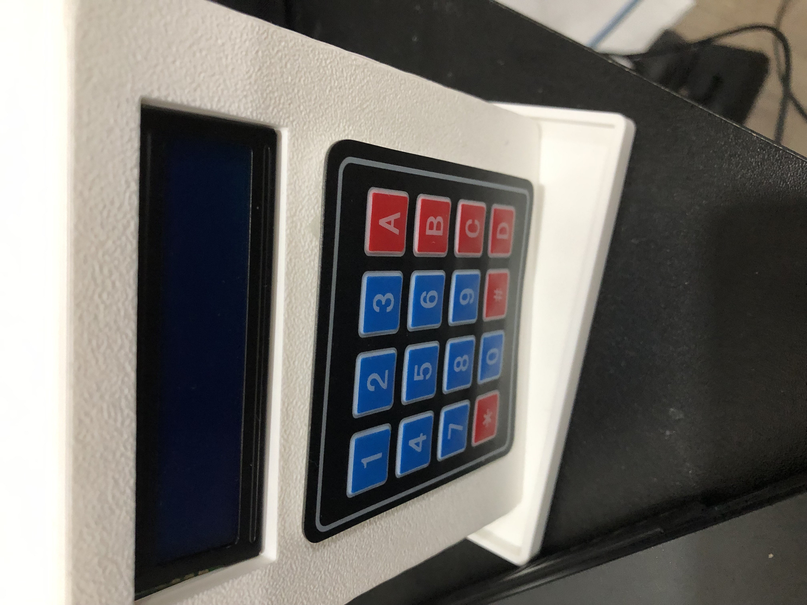

# Nexus
Ever woke up late for school? And then missed the bus? Well, Nexus, is a device that not only provides basic features like the time, date, and weather, but also the next bus arrival. Instead of needing to get your phone, you can seemlessly chomp down on your breakfast, and get dressed before you know it! 


`Demo Link:` https://youtube.com/shorts/aetpZ6YrA_w?feature=share
---

## Guide on building Nexus!
*Note: you will need to install PlatformIo in VsCode*

**Components:**
- ESP32
- 4x4 Keypad
- Laptop(i.e. Framework) or Battery
- Jumper wires (or Solder)
- 16 x 2 LCD Screen
- 3D Printed Case or Breadboard for Prototype

---

**Steps**
*Software*
1. Clone the repo: `git clone https://github.com/ryan-mai/Framework-Mod`
2. Create `secrets.h` file in `/src` folder
```h
    const char* ssid = "WiFiName"; // This is needed for everything lol
    const char* password = "WiFiPassword";
    const char* weatherApiKey = "weatherApiKey"; // This is needed for the weather
    const char* googleApiKey = "googleApi Key"; // This is needed for the route API
```
3. In `platformio.ini` file, ensure the configuration is correct (i.e. `upload_port`)
4. Build and Upload from `main.cpp`
5. If you get an `error status 2`, ensure you hold down `boot` on your ESP32

---

*Hardware*
1. Wire the keypad into GPIO 23, 19, 18, 5, 17, 16, 4, & 13 (Starting on the `*`, left to the right side `D`) into the ESP32
2. Wire the LCD into GND, 5V, GPIO 21, GPIO 22 (In order of GND, VND, SDA, SCL) into the ESP32
*Alternatively: Wire each of the previous steps into a breadboard*
3. 3D Print the files from the `assets` folder. **NOTE: The backcase is not tested!**